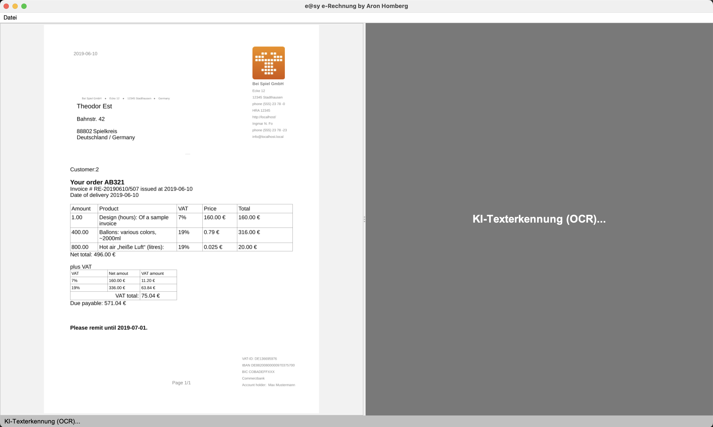
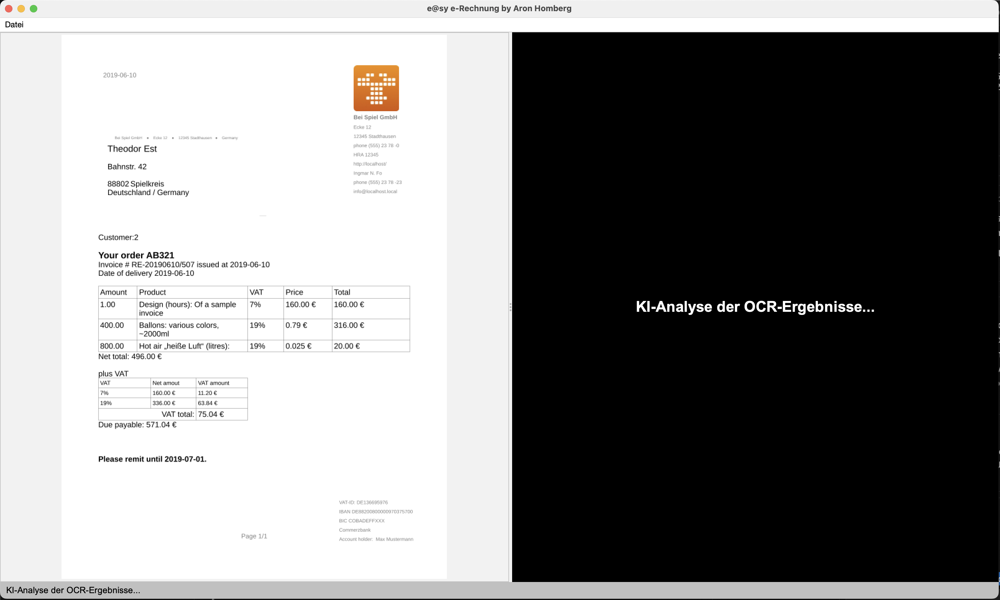
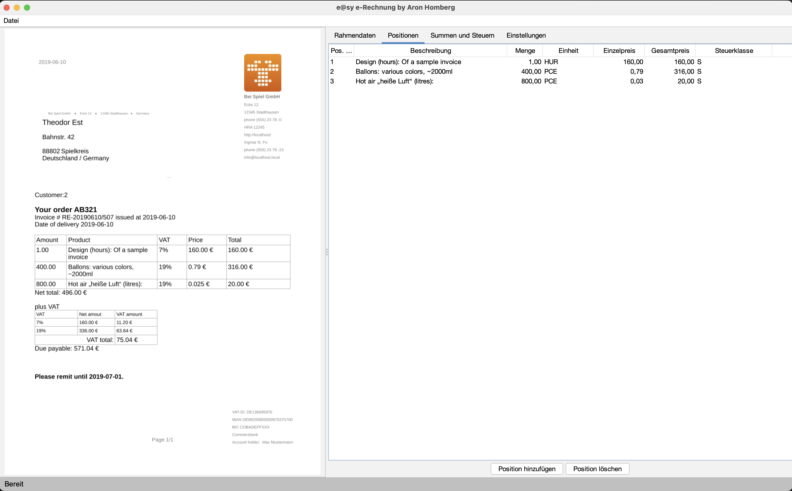
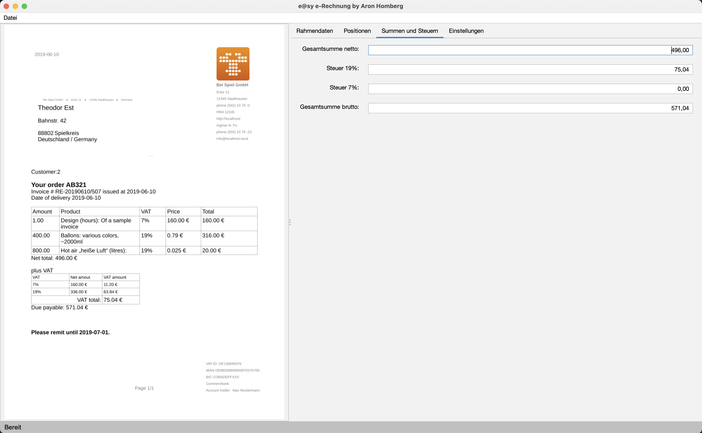
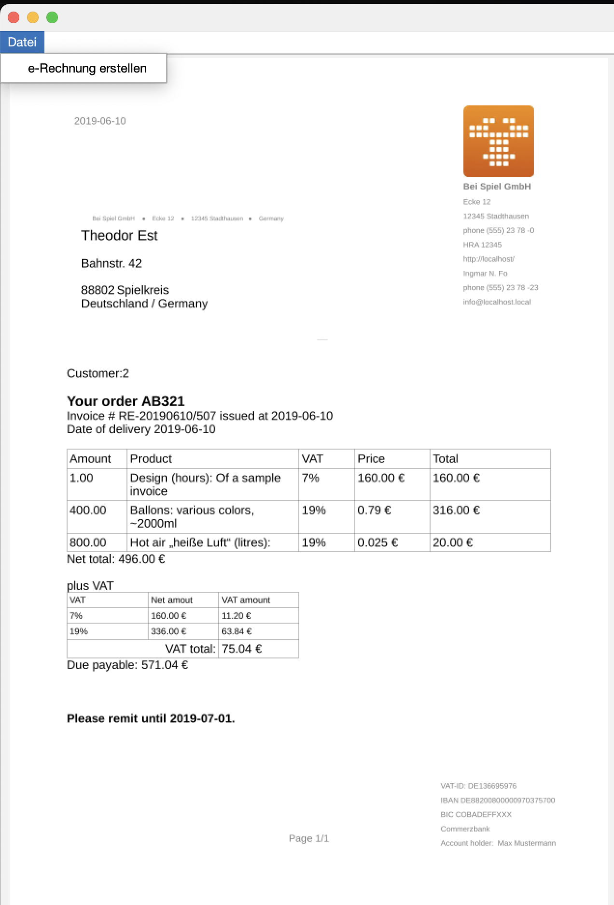
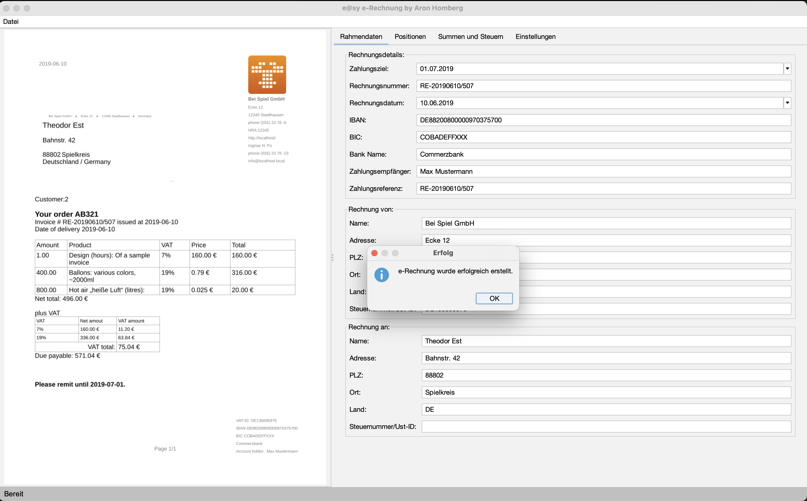
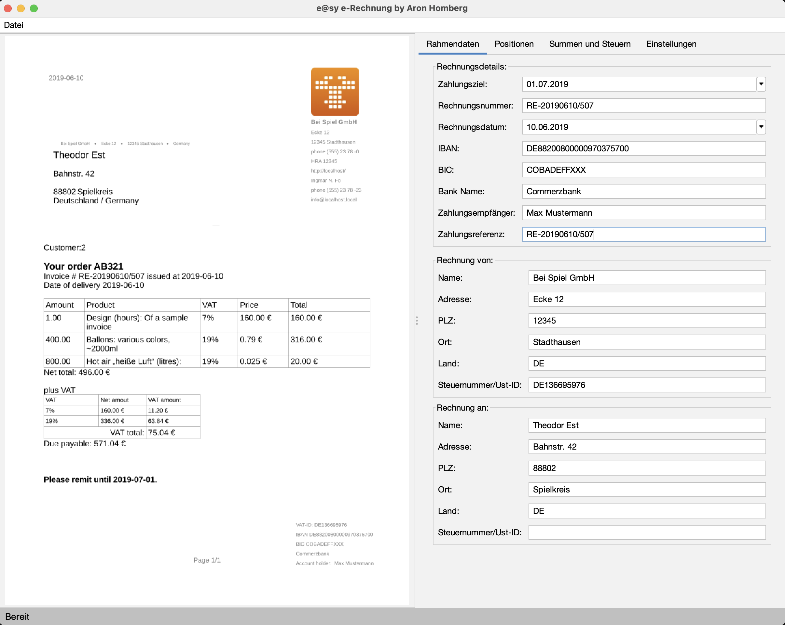
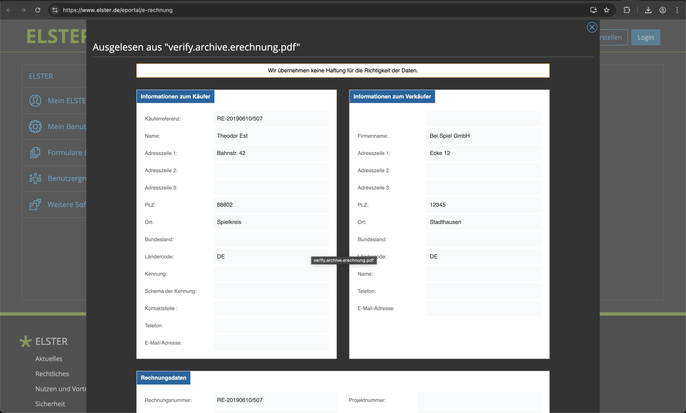
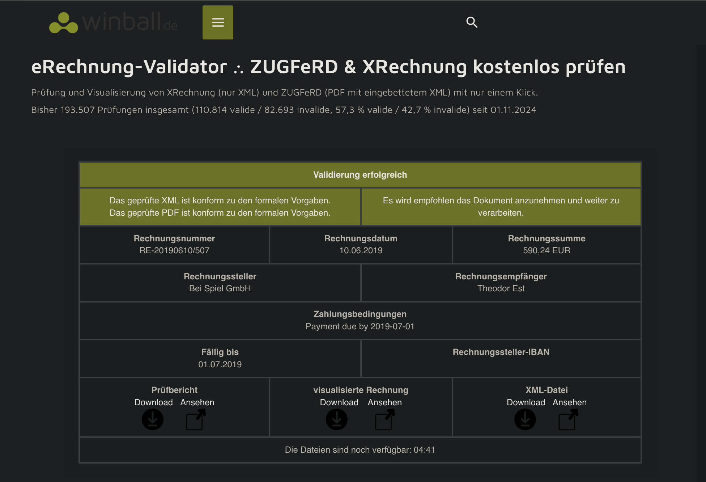

# 🧾 easy-e-rechnung

**Java-App for creating and validating Factur-X / ZuGFeRD / X-Rechnung invoices conforming with EU-Norm EN 16931.**

---

## ✨ Key Features

| Feature | Description |
|---------|-------------|
| 🇪🇺 **EU Compliant** | Generates invoices conforming to **EN 16931**, accepted across all EU member states. |
| 🔒 **100% Offline & Private** | All processing happens locally on your machine. Your invoice data never leaves your computer. |
| 🤖 **LocalAI-Powered OCR** | Uses local, open-weight AI models for automatic, high-quality text extraction from PDF invoices. |
| 🧠 **Works with Ollama & PaddlePaddle** | Integrates with popular local AI frameworks for flexibility. |
| 💻 **Cross-Platform** | Runs on **macOS**, **Linux**, and **Windows**. (macOS is the primary tested platform.) |

---

## 📸 How It Works

### Step 1: Drag & Drop Your Invoice PDF

Simply drag and drop a PDF invoice into the app. The AI-powered OCR will automatically extract the text.



---

### Step 2: AI Post-Processing

The local AI model analyzes the OCR output and intelligently extracts all relevant invoice data.



---

### Step 3: Review Invoice Positions

Review and edit the extracted line items. The app calculates totals automatically.



---

### Step 4: Review Taxes & Totals

Verify the tax calculations and monetary summations.



---

### Step 5: Create the e-Invoice

Click to generate the ZuGFeRD/Factur-X compliant PDF with embedded XML.



---

### Step 6: Invoice Created Successfully

The app confirms successful creation and automatically opens the ELSTER e-Rechnung portal for official validation.



---

### Step 7: View the Final Output

Your new e-Invoice is ready.



---

## ✅ Validated by Official Tools

### ELSTER (German Tax Authority)



### Other Validators



---

## 🚀 Setup

```bash
# Activate the Python virtual environment
source venv/bin/activate

# Install dependencies
python install.py

# Run OCR on a demo invoice
python ocr.py demo/verify.pdf demo/verify.md

# Compile the App
./compile.sh

# Start the App
./start.sh
```

### OCR Device/Backend Overrides

`ocr.py` now auto-selects the OCR runtime device:
- uses `gpu:0` when Paddle CUDA is available
- otherwise falls back to `cpu`

Optional environment variables:

```bash
# Force Paddle device (examples: cpu, gpu:0)
export EASY_ERECHNUNG_OCR_DEVICE=gpu:0

# Optional: Use external VL backend/server for acceleration
# Supported backend values: native, vllm-server, sglang-server, fastdeploy-server
export EASY_ERECHNUNG_OCR_VL_BACKEND=vllm-server
export EASY_ERECHNUNG_OCR_VL_SERVER_URL=http://localhost:8000
```

On macOS with MLX installed, the app prints a hint that PaddleOCR-VL native mode does not directly use MLX. In that case, use an external accelerated backend via the variables above.

---

## 📁 Demo Data

The `demo/` folder contains sample invoice data for testing and demonstration purposes.

## 🧑‍💻 Calling the OCR pipeline via Shell

```bash
bun run src/ocr.ts --input demo/verify_multipage.pdf --output /tmp/test_multipage_v2.json --seller-address "Friedrich-Damm-Str. 8, 80999 München" --seller-tax-no "147/214/00001"
```
---

## 📜 License

MIT, Open Source.

---

## 🛡️ Privacy Promise

- **No network requests.** All AI inference runs locally.
- **No telemetry.** Your data stays on your device.
- **Open Source.** Audit the code yourself.
